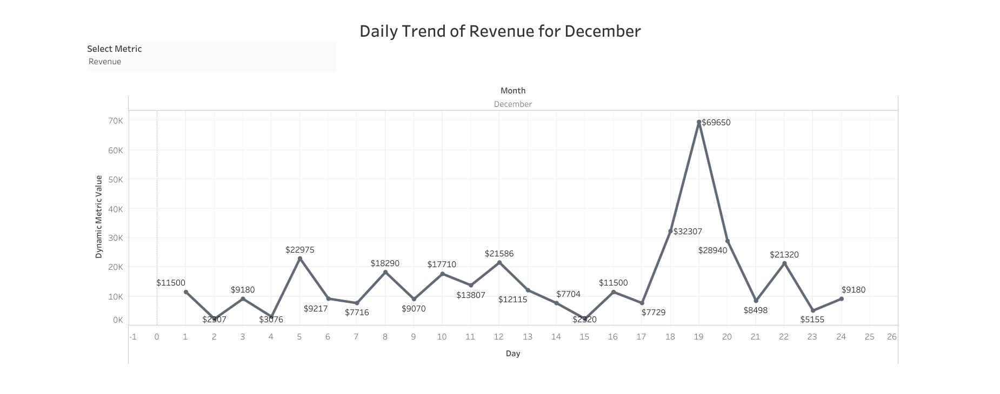

# Dynamic Measure Selector - Tableau

I created a Dynamic Measure Selector that allows users to switch between different metrics like Revenue, Order Quantity and Discount using a dropdown.

---

##  What's Special About This Dashboard

✅ Dynamic metric selection using parameters  
✅ Context-aware formatting:  
- `$` symbol for **Revenue**
- Plain numbers for **Order Quantity**
- `%` format for **Discount**

✅ Trend lines with labeled data points  
✅ Clear comparison of business metrics over time.

---

##  Dashboard Preview

> View the interactive dashboard here [Tableau Public](https://public.tableau.com/app/profile/naina.sonkar/viz/DynamicMeasureSelector_17452395876960/Dashboard1)
