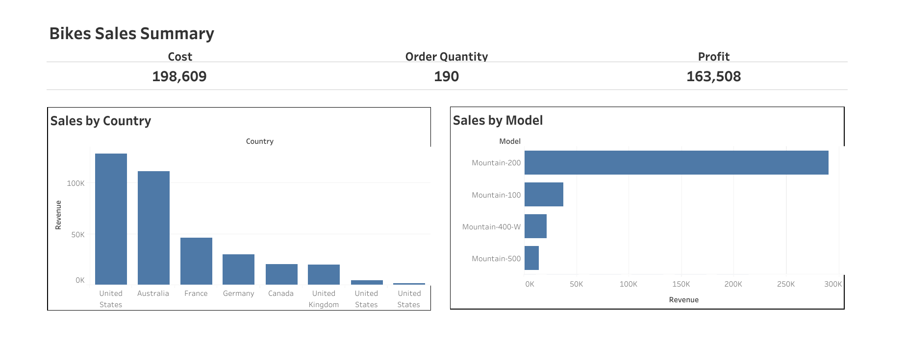

#  Bike Sales Summary – Tableau Project

This dashboard visualizes bike sales performance using interactive charts and KPIs built in Tableau.

---

##  KPIs Tracked

| Metric         | Value    |
|----------------|----------|
| **Total Cost** | 198,609  |
| **Order Qty**  | 190      |
| **Profit**     | 163,508  |

---

##  Key Visuals & Insights

- **Sales by Country:** The United States and Australia lead in bike sales revenue.
- **Sales by Model:** The Mountain-200 model generated the highest revenue.
- **Profit vs Cost:** High profitability is driven by a few top-performing models and markets.
- **Order Quantity Distribution:** Averages are skewed towards high-selling models.

---

#  Dashboard Preview

