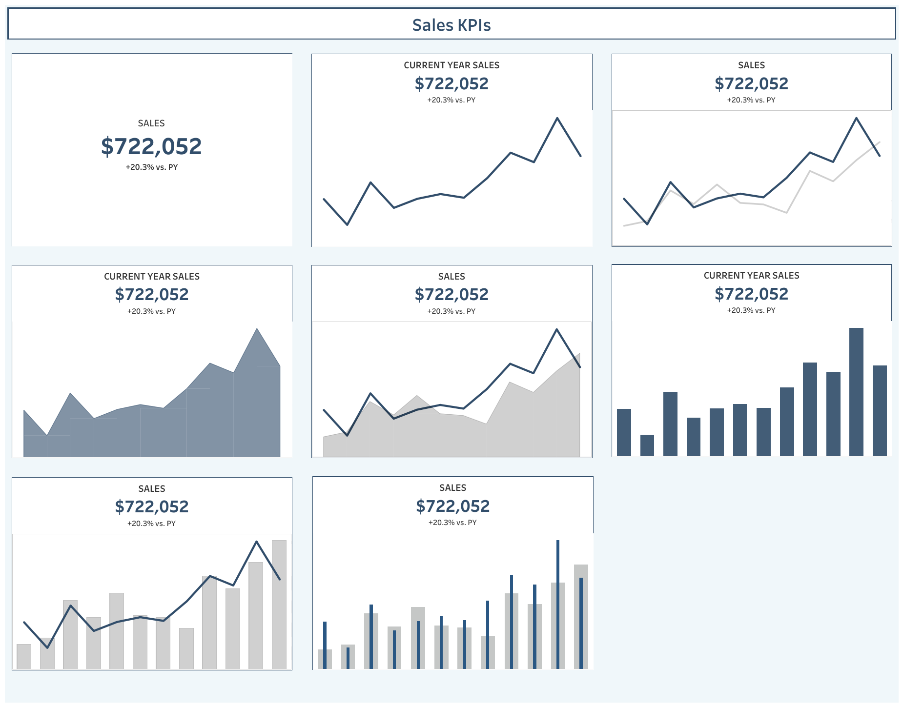

# Tableau KPI Dashboard

This Tableau Dashboard shows KPIs (Key Performance Indicators) that highlight sales KPIs, including total sales, year-over-year growth, and performance trends for current vs. previous year years.

## Overview

- **Total Sales**: $722,052  
- **Growth**: +20.3% vs. Previous Year  
- Visualized using multiple chart types (line, bar, area, combo charts) for a detailed view.

## Dashboard Preview

> View the Interactive version here on 
